

# PA4 Submission: TaskFlow Pipeline

Copy this file to <code style="color:#111827;background:#ddd6fe;padding:2px 4px;border-radius:4px;">SUBMISSION.md</code>. Put every screenshot in <code style="color:#111827;background:#ddd6fe;padding:2px 4px;border-radius:4px;">docs/</code>, embed it under the correct task, and write a short description below each image explaining what it proves. The grader should not need any file outside this repository.

## Student Information

| Field | Value |
|---|---|
| Name | Muhammad Haris Baig |
| Roll Number | 27100205 |
| GitHub Repository URL | https://github.com/baigharis7/cloud-processing-app |
| Resource Group | `rg-sp26-27100205` |
| Assigned Region | TODO: `ukwest` |

## Evidence Rules

- Use relative image paths, for example: ``.
- Every image must have a 1-3 sentence description below it.
- Azure Portal screenshots must show the resource name and enough page context to identify the service.
- CLI screenshots must show the command and output.
- Mask secrets such as function keys, ACR passwords, and storage connection strings.

## Task 1: App Service Web App (15 points)

### Evidence 1.1: Forked Repository

TODO: 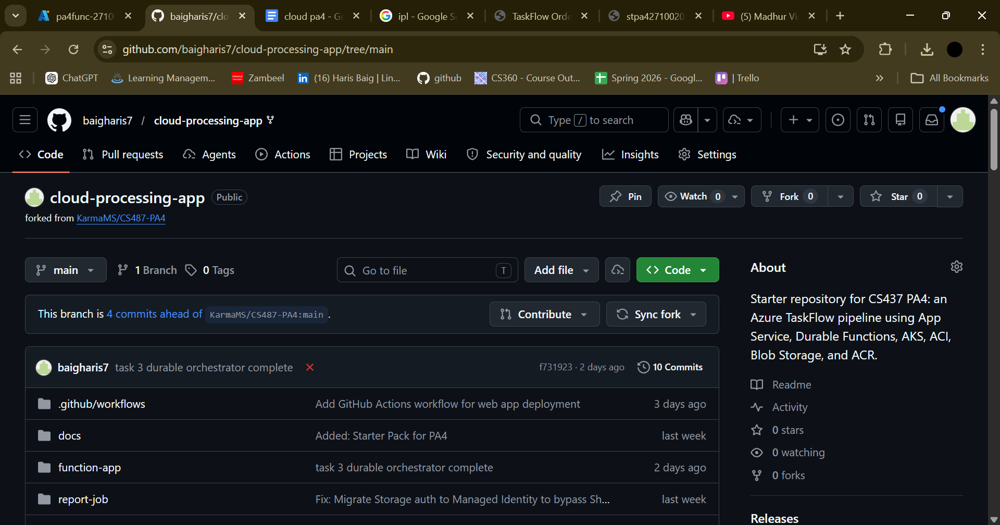

Description: This screenshot shows my forked GitHub repository containing the complete PA4 starter structure and implementation files. The repository includes the web application, Durable Functions application, Kubernetes validator API, report generation container, and submission documentation required for the assignment.

### Evidence 1.2: App Service Overview

TODO: 

Description: This screenshot shows the Azure App Service Web App `pa4web-27100205` deployed in the `rg-sp26-27100205` resource group within the `UK West` region. The application is running successfully on Linux App Service infrastructure and exposes the public TaskFlow frontend URL.

### Evidence 1.3: Deployment Center / GitHub Actions

TODO: 1.3.png

Description: This screenshot shows the Deployment Center configuration connecting the Azure Web App to my GitHub repository. Continuous deployment was configured so that pushes to the repository automatically triggered deployment updates to the App Service.

### Evidence 1.4: Live Web UI

TODO: 

Description: This screenshot shows the live TaskFlow frontend successfully hosted through Azure App Service. The frontend UI is accessible publicly and allows users to submit orders that trigger the backend Durable Functions workflow.
---

## Task 2: Azure Container Registry (15 points)

### Evidence 2.1: ACR Overview

TODO: 

Description: This screenshot shows the Azure Container Registry `pa427100205` deployed in the `rg-sp26-27100205` resource group. The registry stores all Docker container images used throughout the assignment, including the validator API, Durable Function App, and report generation job containers.

### Evidence 2.2: Docker Builds

TODO: 

Description: This screenshot shows the successful local Docker builds for the three application components: `validate-api`, `report-job`, and `func-app`. Each service was containerized independently using its own Dockerfile before being tagged and pushed to Azure Container Registry.

### Evidence 2.3: ACR Repositories

TODO: 

Description: This screenshot confirms that all required container images were successfully pushed to Azure Container Registry. The registry contains the `func-app`, `validate-api`, and `report-job` repositories with versioned tags used later for Azure Function App, AKS, and Azure Container Instance deployments.

---

## Task 3: Durable Function Implementation (12 points)

### Evidence 3.1: Completed Function Code

TODO: Link to your completed file: `[function_app.py](function-app/function_app.py)`
https://github.com/baigharis7/cloud-processing-app/blob/main/function-app/function_app.py

Description: The Durable Functions workflow was implemented inside `function_app.py` using Python Durable Functions patterns. The `http_starter` function accepts incoming order requests and starts the orchestration instance. The `my_orchestrator` controller coordinates the complete workflow by first invoking `validate_activity` to validate the order through the AKS validator service and then invoking `report_activity` to dynamically create an Azure Container Instance for PDF report generation and Blob Storage upload.

### Evidence 3.2: Local Function Handler Listing

TODO: 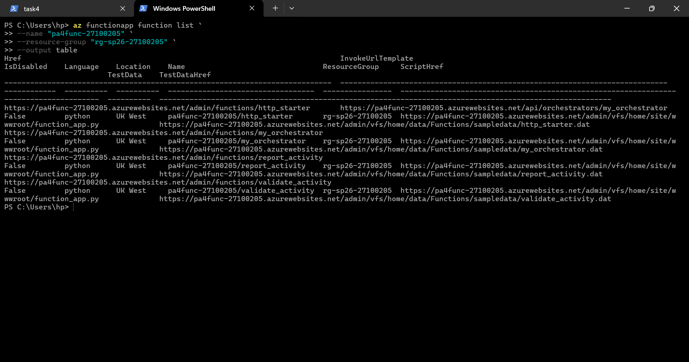

Description: This screenshot confirms that the Azure Function App successfully discovered and registered all Durable Functions workflow handlers, including the HTTP starter trigger, orchestration controller, validator activity, and report generation activity functions deployed in `function_app.py`.
---

## Task 4: Function App Container Deployment (8 points)

### Evidence 4.1: Function App Container Configuration

TODO: 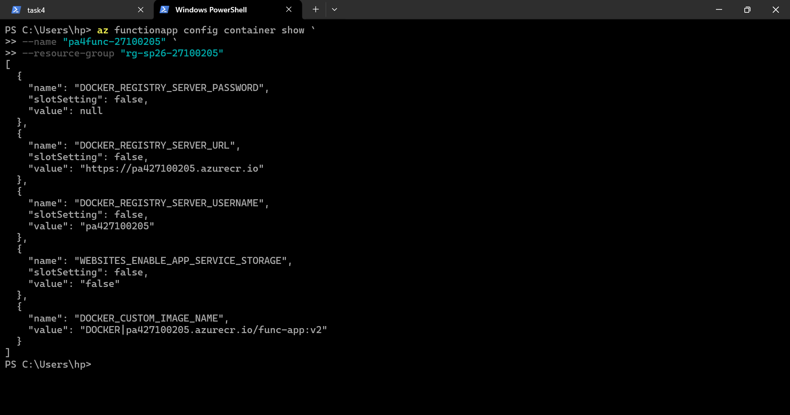

Description: This screenshot shows the Azure Function App container configuration using the custom container image `pa427100205.azurecr.io/func-app:v2` hosted in Azure Container Registry. The Function App was deployed using a Linux container runtime model.

### Evidence 4.2: Orchestration Smoke Test

TODO: 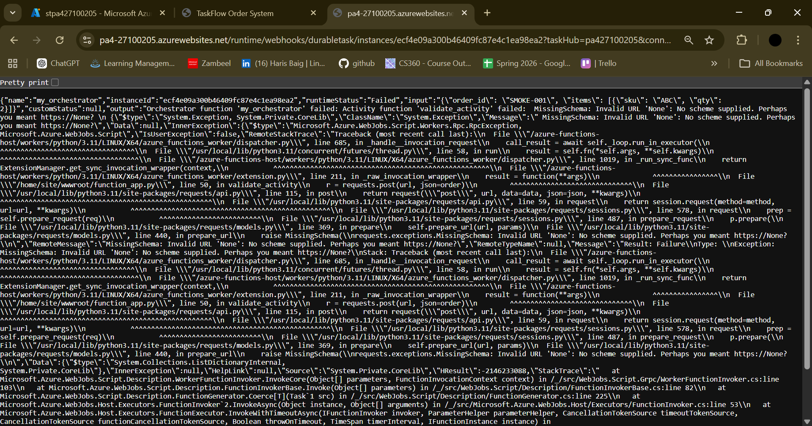

Description: This screenshot shows a successful orchestration smoke test performed using the Durable Functions HTTP starter endpoint. The returned orchestration instance ID and status polling URLs confirm that the Durable Functions runtime successfully started and registered the orchestration workflow.

### Evidence 4.3: Expected Failed Status Before Downstream Wiring

TODO: 
Description: This screenshot shows the Durable Function orchestration reaching the validate_activity stage and failing because the downstream VALIDATE_URL environment variable was not configured at this intermediate stage. The error confirms that the Function App, Durable Functions runtime, orchestration trigger, and activity execution pipeline were all deployed and functioning correctly.

---

## Task 5: AKS Validator (15 points)

### Evidence 5.1: AKS Cluster

TODO: 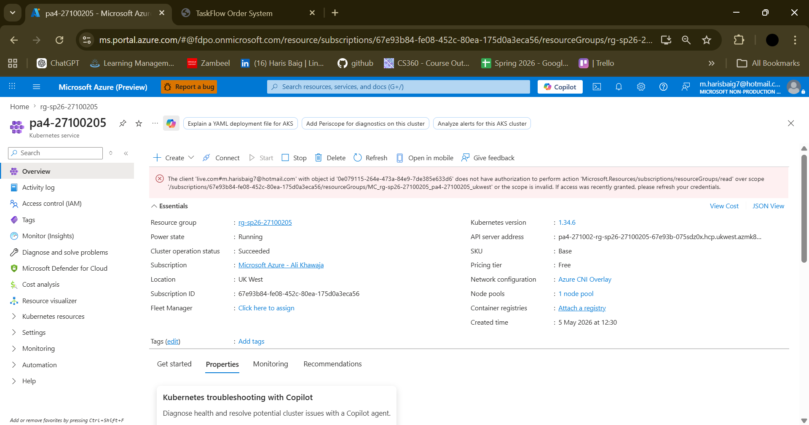

Description: This screenshot shows the AKS cluster `pa4-27100205` successfully deployed in the `UK West` region under the resource group `rg-sp26-27100205`. The cluster contains a running node pool hosting the validator API service for the TaskFlow pipeline.

### Evidence 5.2: Kubernetes Nodes and Pods

TODO: 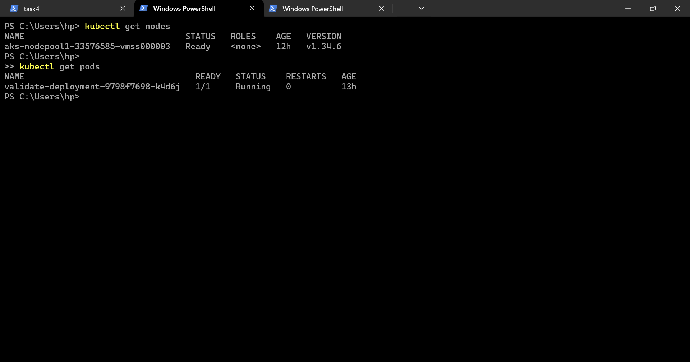

Description: This screenshot shows the Kubernetes worker node in `Ready` state and the validator deployment pod successfully scheduled and running inside the AKS cluster. This confirms that the validator container was deployed correctly through Kubernetes.

### Evidence 5.3: Kubernetes Service

TODO: 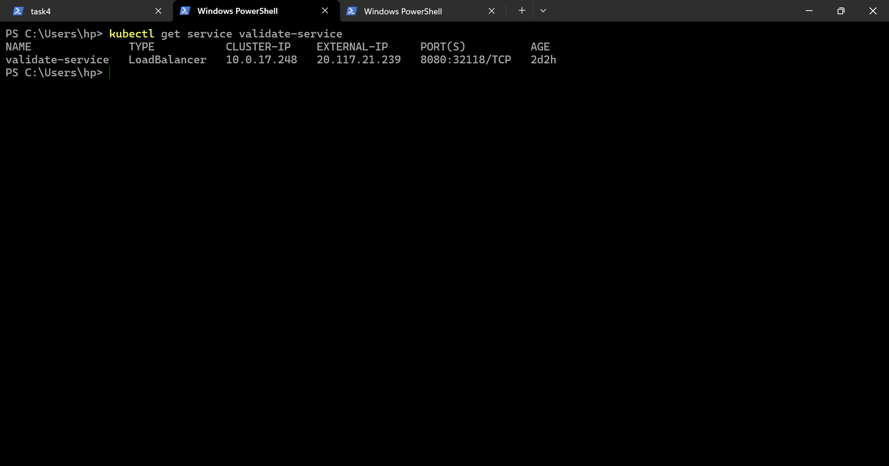

Description: This screenshot shows the Kubernetes `LoadBalancer` service exposing the validator API externally through the public IP address `20.117.21.239` on port `8080`. The Durable Function uses this endpoint during orchestration validation.

### Evidence 5.4: Validator API Tests

TODO: 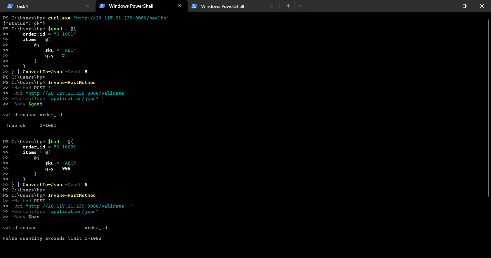

Description: This screenshot demonstrates successful validator API testing. The `/health` endpoint confirms service availability, valid orders are accepted successfully, and invalid orders with quantity greater than 100 are rejected according to the business validation rule implemented in the validator service.

### Evidence 5.5: Function App `VALIDATE_URL`

TODO: 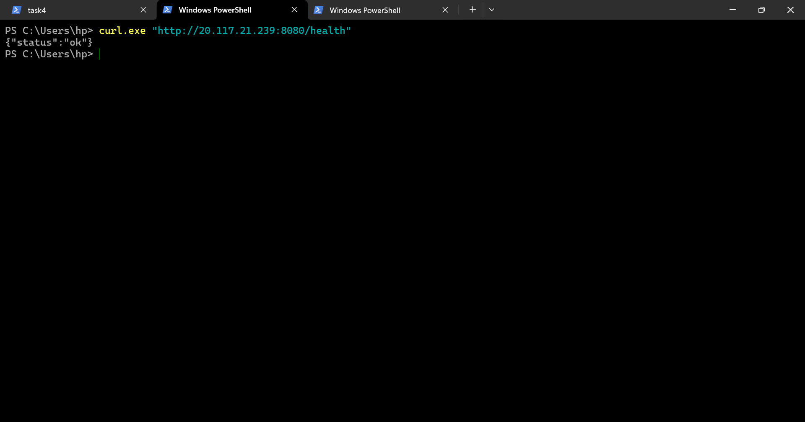

Description: This screenshot shows the `VALIDATE_URL` application setting configured inside the Function App. The Durable Function uses this endpoint to communicate with the AKS-hosted validator API during orchestration execution.

### Evidence 5.6: AKS Idle Behavior

TODO: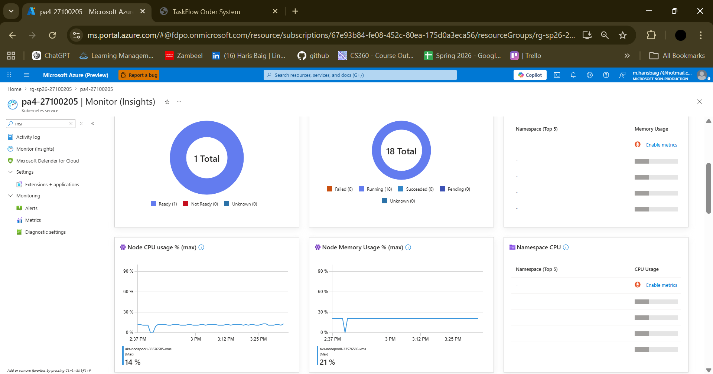

Description: This screenshot demonstrates that the AKS node remains running even when the validator workload is idle and there are no active orders being processed. Unlike Azure Container Instances, AKS continuously maintains allocated cluster infrastructure regardless of request traffic.

---

## Task 6: ACI Report Job (15 points)

### Evidence 6.1: Blob Container

TODO: 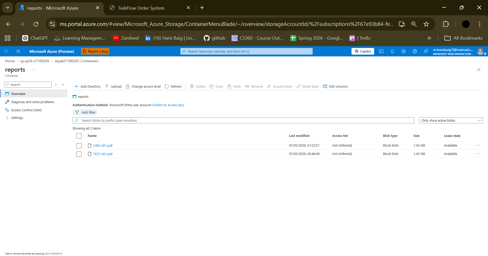

Description: This screenshot shows the `reports` Blob Storage container where generated PDF reports are stored after successful ACI execution. Each completed order generates a PDF file uploaded into this container for persistent storage.

### Evidence 6.2: Manual ACI Run

TODO: 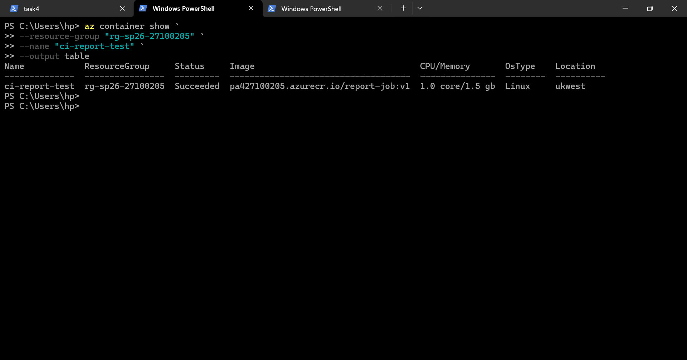

Description: This screenshot shows the manually executed Azure Container Instance `ci-report-test` in `Succeeded` state. The container exits automatically after completing its one-time PDF generation and upload task.

### Evidence 6.3: ACI Logs

TODO: 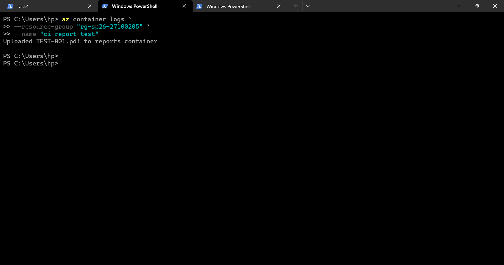

Description: This screenshot shows the execution logs from the Azure Container Instance report job. After generating the PDF file, the container successfully uploaded `TEST-001.pdf` into the Blob Storage reports container.

### Evidence 6.4: Generated PDF

TODO: 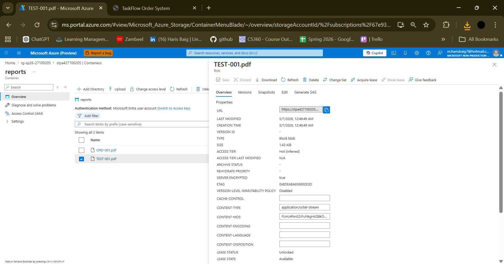 

Description: This screenshot shows the generated `TEST-001.pdf` report stored inside Azure Blob Storage. This confirms that the ACI workload successfully wrote the generated PDF artifact into persistent cloud storage.

### Evidence 6.5: Function App Managed Identity and IAM

TODO: 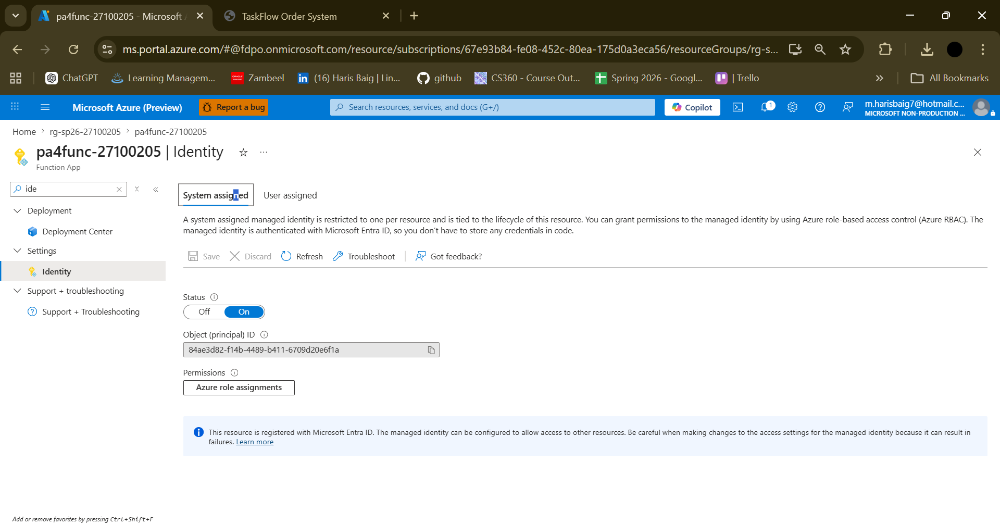 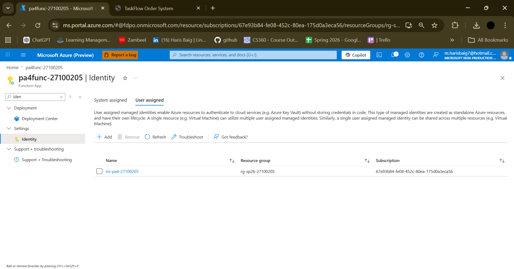 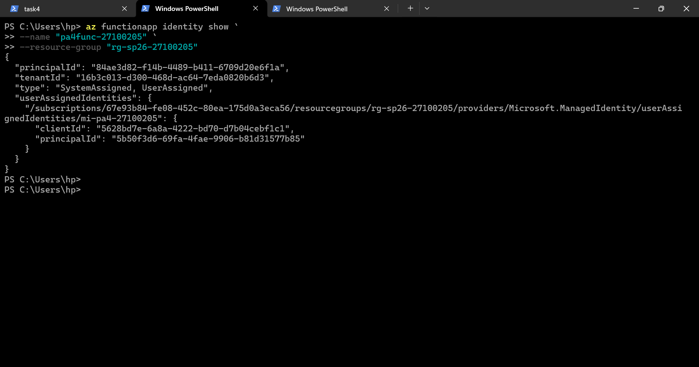

Description: These screenshots show that the Function App has both system-assigned and user-assigned managed identities enabled. The attached managed identity `mi-pa4-27100205` is used by the Durable Function to securely authenticate with Azure services during ACI creation and Blob Storage operations without storing credentials directly inside application code.

### Evidence 6.6: Report App Settings

TODO: 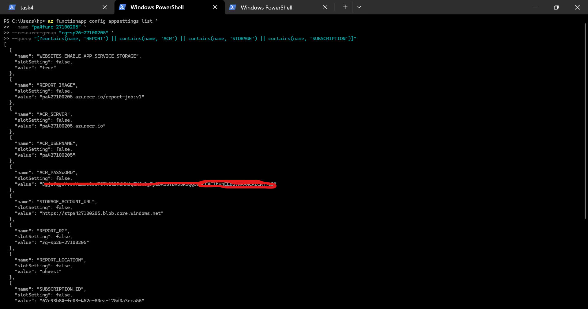

Description: This screenshot shows the Function App application settings used for dynamic report container creation. The `REPORT_*` settings identify the ACI image and deployment configuration, `ACR_*` settings provide container registry access, `STORAGE_*` settings define the Blob Storage endpoint, and `SUBSCRIPTION_ID` identifies the Azure subscription used for resource deployment.

---

## Task 7: End-to-End Pipeline (15 points)

### Evidence 7.1: Web App Wiring

TODO: 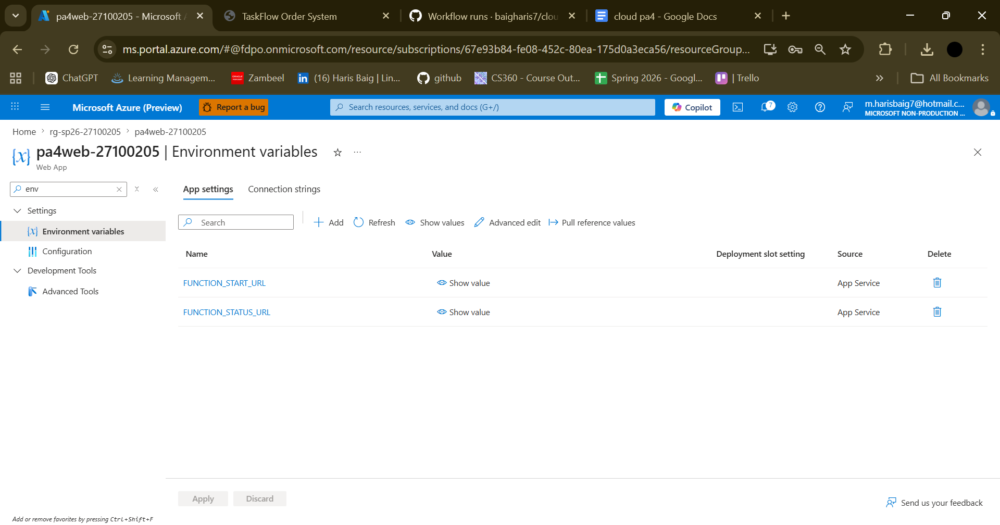

This screenshot shows the frontend Web App configured with the Durable Function starter endpoint and orchestration status polling endpoint through environment variables. The frontend uses these URLs to start new workflows and continuously monitor orchestration progress.
### Evidence 7.2: Happy Path UI

TODO: 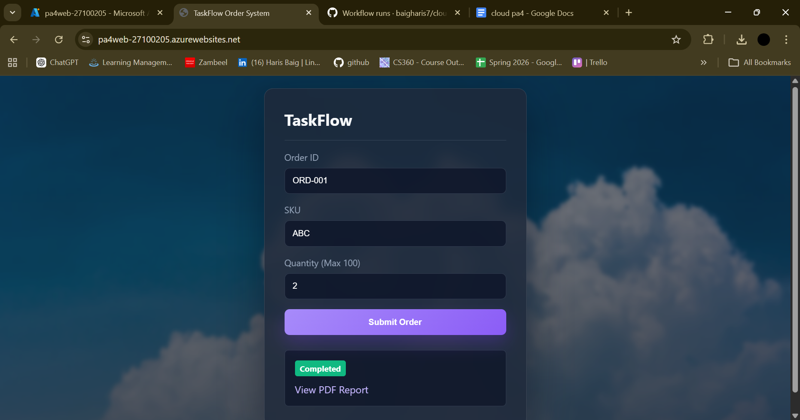 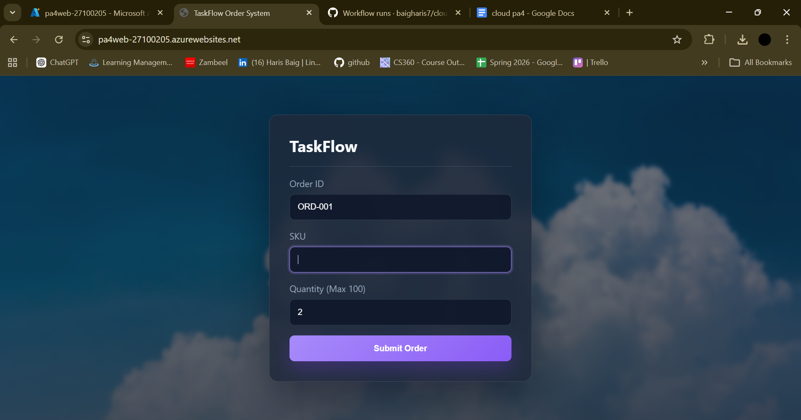 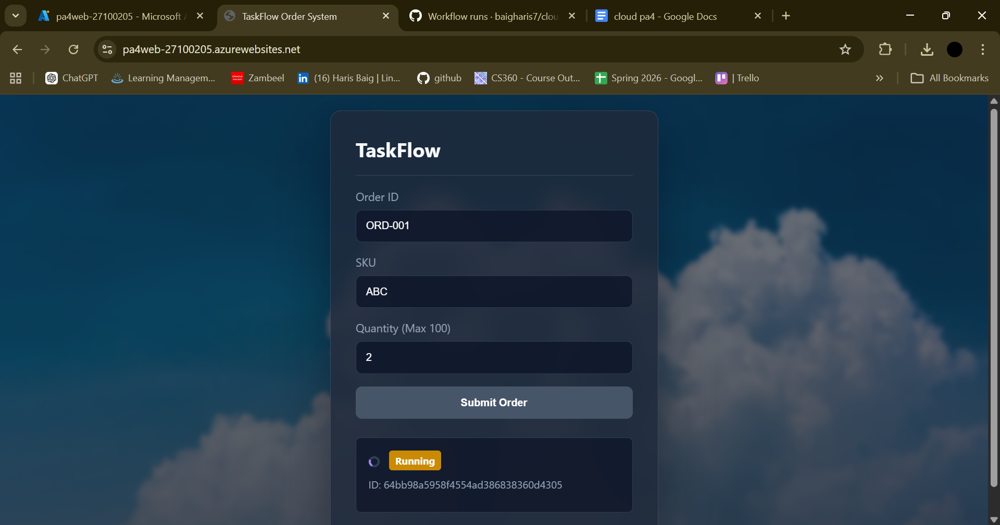

This evidence demonstrates the successful execution of the complete TaskFlow pipeline through the frontend UI. A valid order with quantity less than or equal to 100 was submitted, the orchestration entered the Running state, and finally completed successfully with a generated PDF report URL.
### Evidence 7.3: Backend Participation

TODO: 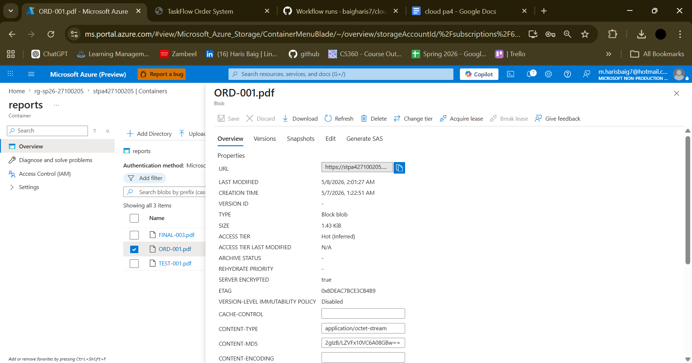

These screenshots trace the same order ID across all backend services involved in the orchestration workflow. The Durable Function started the orchestration, the AKS validator approved the request, the Azure Container Instance generated the report, and the final PDF was uploaded successfully to Azure Blob Storage.

### Evidence 7.4: Reject Path UI

TODO: 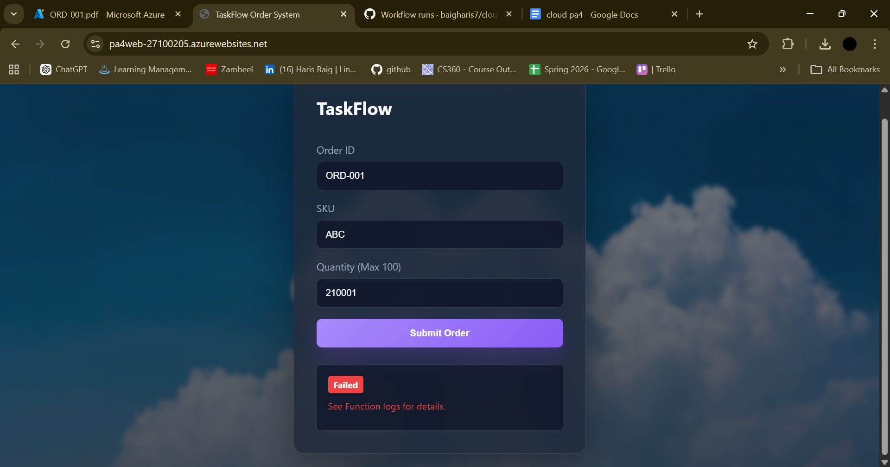

This screenshot demonstrates the rejection flow of the application. An order with quantity greater than 100 was submitted, causing the validator service to reject the request and stop the orchestration before report generation. As a result, no Azure Container Instance or PDF report was created.
---

## Task 8: Write-up and Architecture Diagram (5 points)

### Evidence 8.1: Architecture Diagram

TODO: 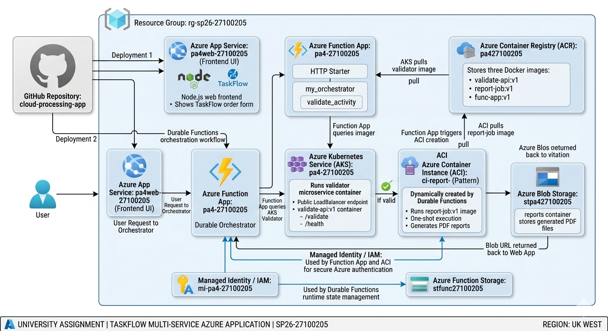

Description: TODO: Confirm that it shows GitHub, App Service, Durable Function, AKS, ACI, Blob Storage, ACR, and IAM.

### Question 8.2: Service Selection

TODO: In 3-4 sentences each, explain why TaskFlow uses App Service, Durable Functions, AKS, and ACI for their specific roles.

App Service

Azure App Service was used to host the frontend web application because it provides a simple and fully managed environment for deploying Node.js applications. It supports automatic GitHub-based deployment and HTTPS hosting without requiring infrastructure management. Since the frontend is a continuously running web application, App Service was the most appropriate choice.

Durable Functions

Durable Functions were used to coordinate the multi-step workflow involving validation and report generation. The orchestration model allows activities to execute sequentially with built-in state persistence and checkpointing. This makes the workflow reliable even if one step takes a long time or temporarily fails.

AKS

AKS was selected for the validator service because it represents a long-running microservice that must always remain available to process incoming validation requests. Kubernetes also provides container orchestration, scalability, service abstraction, and load balancing. This reflects a realistic enterprise microservice deployment model.

ACI

Azure Container Instances were used for the report generator because the workload is short-lived and executes only when a valid order is received. ACI is ideal for one-shot jobs since containers start on demand and terminate after completion, avoiding the overhead of managing a persistent cluster.

### Question 8.3: ACI vs AKS

TODO: Compare idle behavior, cost behavior, and operational model for AKS and ACI using your screenshots.

AKS keeps its node running continuously even when there are no incoming requests, which means compute costs continue during idle periods. In contrast, ACI containers are created only when required and terminate after completing the assigned job, resulting in lower idle cost. Operationally, AKS requires Kubernetes management, deployments, services, and cluster monitoring, while ACI provides a lightweight serverless-style execution model for temporary workloads.

### Question 8.4: Durable Functions vs Plain HTTP

TODO: Explain at least two problems that Durable Functions solves for this sequential workflow.

Durable Functions solve the problem of coordinating long-running workflows across multiple services. In this project, the orchestrator waits for validation to complete before triggering report generation while automatically preserving workflow state between activities. Durable Functions also provide retry capability and orchestration tracking, which would be difficult to implement reliably using regular HTTP functions alone.

### Question 8.5: Cost Review

TODO: Embed Cost Management screenshot scoped to your resource group.
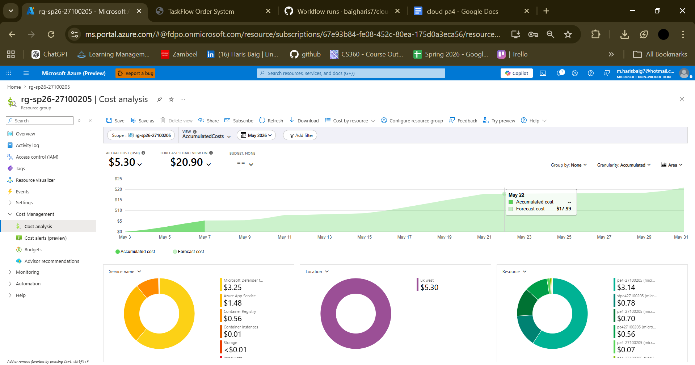

The most expensive resource is pa4-27100205, with a current cost of $3.14. This likely accounts for the majority of the $3.25 attributed to "Microsoft Defender for Cloud," suggesting that high-tier security features or continuous scanning are active on this specific resource

### Question 8.6: Challenges Faced

TODO: Describe at least two real issues you hit and how you debugged them.

One major issue encountered was Azure Storage authentication failure after deploying the Function App. Shared key authentication was restricted by subscription policy, causing the Durable Functions runtime to fail during startup. This was resolved by switching the Function App storage configuration to Managed Identity authentication using the AzureWebJobsStorage__accountName and AzureWebJobsStorage__credential settings.

Another issue occurred when the original frontend Web App was unintentionally overwritten during Function App deployment because both services initially used the same naming convention. This caused the frontend UI to disappear even though the backend services continued functioning correctly. The problem was resolved by creating a separate frontend Web App and reconnecting the original GitHub Actions deployment workflow.

---
